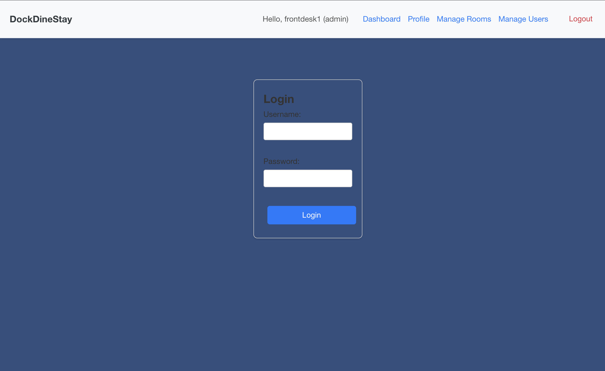
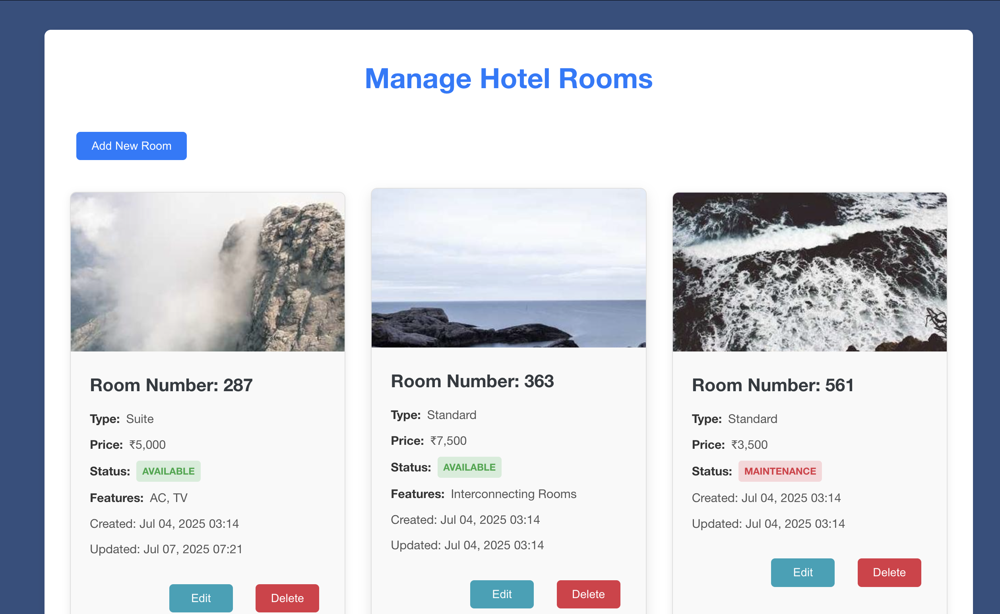

# 🚢🏨🍽️ DockDineStay

## 📌 Project Overview

**DockDineStay** is a comprehensive web application designed to manage multiple services offered by a hospitality business — including hotel room bookings, cafeteria services, and boat rentals.

It provides a seamless experience for both administrators/staff and customers, with full support for user authentication, role-based access control, and CRUD operations across all service domains.

---

## 🚀 Features

### 🔐 User Management
- User registration and login/logout.
- Role-based access control: **Admin**, **Front Desk**, **Back Desk**, and **Customer**.
- Admin can create, update, and delete users.
- All users can update their own profiles.

### 🏨 Hotel Room Management
- Admin can manage hotel room details: room number, type, price, status, features, and image.
- Authenticated users can view available rooms.

### 📅 Hotel Booking Management
- Users can create and manage their own hotel bookings.
- Admin/Staff can view, update, and delete any booking.
- Room availability is checked during booking creation/updates.

### 🍴 Cafeteria Management (To be added )
- Admin/Staff can manage cafeteria tables and menu items.
- Authenticated users can place orders.
- Orders can be updated or removed by Admin/Staff.

### 🚤 Boat Rental Management (To be added )
- Admin can manage boats and their details.
- Authenticated users can make bookings.
- Admin/Staff manage all boat rental activities.

### 💻 Responsive UI
- Built with **React.js** and **TypeScript**.
- Clean and modern responsive interface.

---

## 🛠️ Technologies Used

### 🔙 Backend (FastAPI)
- **Python**
- **FastAPI**: API framework
- **Pydantic**: Schema validation
- **Motor**: Async MongoDB driver
- **PyJWT**: Authentication
- **Passlib**: Password hashing
- **Uvicorn**: ASGI server
- **python-dotenv**: Env variable handling
- **python-multipart**: Form data support

### 🔜 Frontend (React + Vite)
- **React.js**
- **TypeScript**
- **Vite**: Frontend build tool
- **React Router DOM**
- **Axios**
- **date-fns**
- **jwt-decode**
- **CSS Modules**

### 🧩 Database
- **MongoDB**

---

## 🗂️ Folder Structure (Simplified)

```plaintext
├── assets/                  # Images, UI assets
├── backend/
│   └── src/dockdinestay/
│       ├── auth/            # JWT, OAuth, login utils
│       ├── configs/         # Config files (JSON/env)
│       ├── db/              # MongoDB operations (CRUD)
│       └── routers/         # FastAPI route definitions
├── frontend/
│   └── dockDineStay/
│       └── src/
│           ├── api/         # Axios API services
│           ├── components/  # Reusable UI components
│           ├── context/     # Auth context provider
│           ├── pages/       # Route pages (Login, Admin, etc.)
````

## 🔧 Backend Sample (FastAPI)

### 🚦 Routing Example: `routes/rooms.py`

```python
@router.get("/rooms", response_model=List[RoomOut])
async def get_rooms():
    rooms = await room_collection.find().to_list(100)
    return rooms

@router.post("/rooms", response_model=RoomOut)
async def create_room(room: RoomIn):
    result = await room_collection.insert_one(room.dict())
    return room
````

### 📄 Pydantic Models Example: `models/room.py`

```python
from pydantic import BaseModel
from typing import Optional

class RoomIn(BaseModel):
    number: str
    room_type: str
    price: float
    status: str
    features: Optional[list[str]] = []
    image_url: Optional[str] = None

class RoomOut(RoomIn):
    id: str
```

---

## 💻 Backend Docs 

### 📸 Api Docs on Ui

* 🧾 **backend**
  * Docks in ui
  * deployed_uri/docs -> example -- http://127.0.0.1:8000/docs

  


## 💻 Frontend Pages (React)

### 📸 UI Previews

* 🧾 **Login Page**

  * Email + password
  * Redirect to dashboard based on role

  

* 🛏️ **Hotel Room Listing**

  * Responsive cards showing room type, price, and status
  * Booking button for authenticated users

  

* 📅 **Booking Page** (Added in hotel rooms app)

  * Form to select room and date
  * Availability validation via API

* 🍴 **Cafeteria Page** (yet to integrate)

  * Table status (occupied/free)
  * Menu browsing and ordering

* 🚤 **Boat Rentals** (yet to integrate)

  * List of available boats with booking form

📌 *Use `src/pages/` for page-based routing via `react-router-dom`.*

---

## 🔐 Authentication Flow

1. User logs in → JWT stored in localStorage
2. `AuthContext` holds user session & role
3. Axios sends token in headers:

   ```ts
   axios.defaults.headers.common['Authorization'] = `Bearer ${token}`;
   ```

---

## ⚙️ Setup and Installation

### 🔹 Prerequisites
- Python 3.8+
- Node.js
- npm
- MongoDB instance (local or cloud-hosted)

---

## 🔧 Backend Setup

```bash
git clone https://github.com/SunnyRaj94/DockDineStay.git
cd DockDineStay

# Create virtual environment
python -m venv venv
source venv/bin/activate  # On Windows: venv\Scripts\activate

# run start_backend.sh
./start_backend.sh
````

### `.env` || OR || export to os.environ with "ENV_VAR" as prefix 
#### for example -- ENV_VARMONGO_URI to set monogo uri

```env
MONGO_URI="mongodb://localhost:27017/dockdinestay"
ALGORITHM="HS256" #optional
ACCESS_TOKEN_EXPIRE_MINUTES=30 #optional
```

### Run the backend:

```bash
uvicorn app.main:app --reload
```

> FastAPI server runs at: [http://127.0.0.1:8000](http://127.0.0.1:8000)

---

## 🎨 Frontend Setup

```bash
cd ../frontend/dockDineStay
npm install  # or yarn install
```

### `.env` (in `frontend/dockDineStay`)

```env
VITE_API_BASE_URL="http://127.0.0.1:8000"
```

### Run the frontend:

```bash
npm run dev  # or yarn dev
```

> Frontend runs at: [http://localhost:5173](http://localhost:5173)

---

## 🧪 Running the Full Application

1. Start the backend (`uvicorn`) in one terminal.
2. Start the frontend (`npm run dev`) in another terminal.
3. Navigate to [http://localhost:5173](http://localhost:5173) in your browser.
4. Register a user and log in.
5. To assign admin roles, update the user record in your MongoDB database.

---

## 🚀 Deployment (Frontend on Render)

### ✅ Recommended Setup

* **Site Type**: Static Site
* **Build Command**:

  ```bash
  bash start_frontend.sh
  ```
* **Publish Directory**:

  ```
  frontend/dockDineStay/dist
  ```

> For backend deployment (FastAPI + MongoDB), use Render Web Services or another provider. Setup instructions to be added later.

---

## 📌 TODO (Upcoming Enhancements)

* [ ] Admin dashboard with charts and analytics
* [ ] Multi-language support
* [ ] Booking calendar view
* [ ] Notifications (email/SMS)
* [ ] Responsive mobile UI improvements
* [ ] Admin registration endpoint
* [ ] Role management UI
* [ ] Image uploads with preview

---

## 📄 License

MIT License – feel free to use and modify.

---
